<!-- GitHub Profile · jetzasead23 · Jetzael Engine HUD -->
<!-- Local assets: ./assets/  ·  Live: https://github.com/jetzasead23 -->

<a href="https://jetzael.com">
  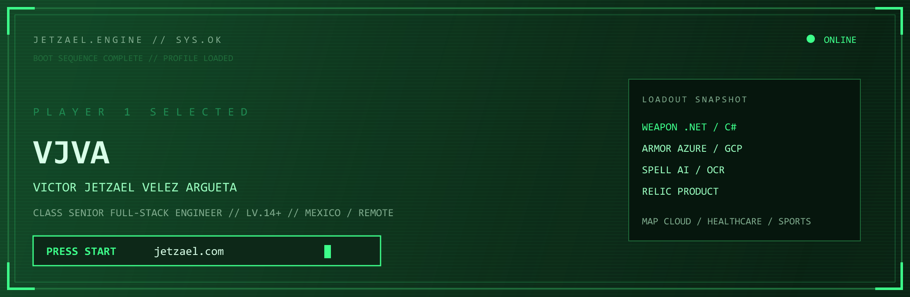
</a>

 

<table>
<tr>
<td width="200" align="center" valign="middle">
  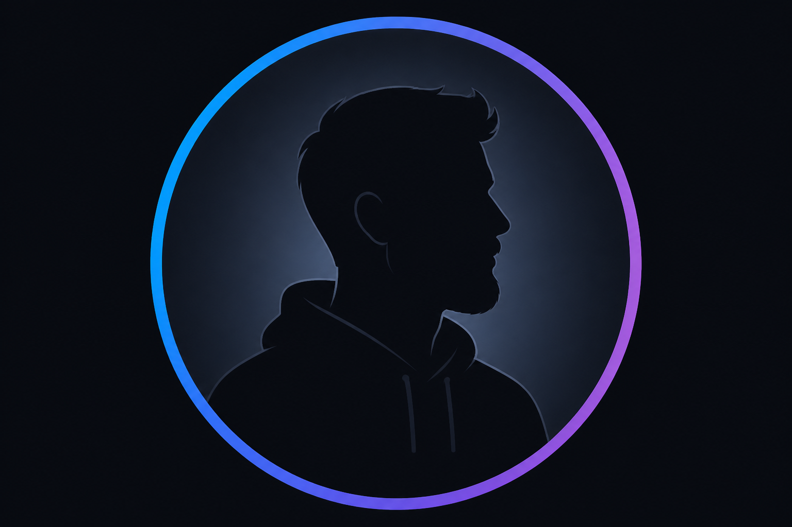
</td>
<td valign="middle">

`PLAYER 1` · `LV.14+` · `CLASS: SENIOR FULL-STACK`

**Victor Jetzael Velez Argueta**

14+ years building AI-powered products, cloud platforms and software that ships.

`Mexico` · `Remote` · `.NET` · `Azure` · `AI`

</td>
</tr>
</table>

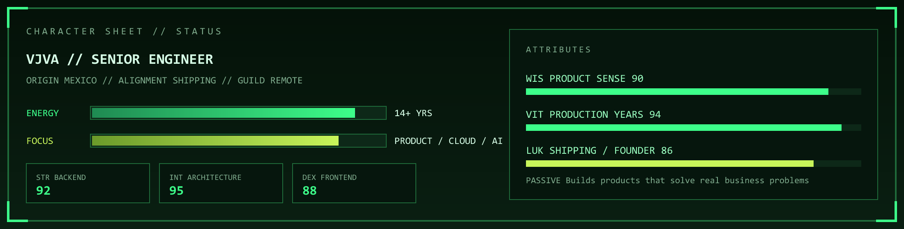

  
  &nbsp;
  
  &nbsp;
  
  &nbsp;
  
  &nbsp;
  

---

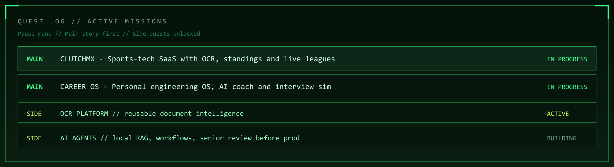

| Slot | Mission | Reward |
|:--|:--|:--|
| **MAIN** | [CLUTCHMX](https://clutch-mx.org/) — amateur leagues, OCR game sheets, live standings | Live pilot · [case study](https://jetzael.com/en/clutchmx/) |
| **MAIN** | [Career OS](https://jetzael.com/engineering-os/) — knowledge graph, interview sim, AI coach | Private engineering OS |
| **SIDE** | OCR Platform — extract, validate, human review | Reusable document intelligence |
| **SIDE** | AI agents — local RAG, workflows, senior review before prod | Faster delivery without skipping judgment |

---

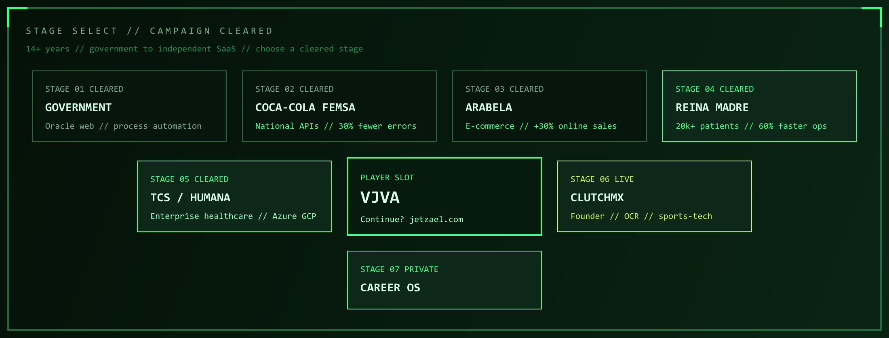

### Campaign journal

| Stage | Chapter | Clear bonus |
|:--|:--|:--|
| 01 | **Government · Mexico** | Internal process automation on Oracle web systems |
| 02 | **Coca-Cola FEMSA** | National operations APIs — **30% fewer errors** |
| 03 | **Arabela** | E-commerce modernization — **+30% online sales** |
| 04 | **Reina Madre** | Microservices for **20k+ patients** — **60% faster ops** |
| 05 | **TCS · Humana** | Enterprise healthcare — Azure, GCP, CI/CD, US delivery |
| 06 | **CLUTCHMX** | Sports-tech founder — live SaaS with OCR pipeline |
| 07 | **Career OS** | Engineering OS — AI, interviews, architecture knowledge |

---

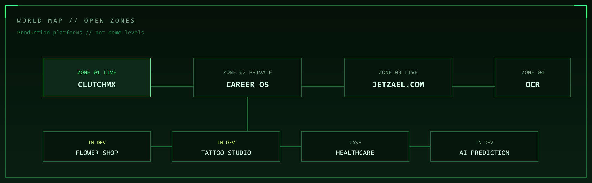

### Zone 01 — CLUTCHMX `LIVE`

Sports-tech SaaS for amateur leagues — OCR game-sheet capture, real-time standings, scheduling and multi-role dashboards on Azure.

| Field | Value |
|:--|:--|
| Problem | Paper score sheets, WhatsApp and Excel do not scale |
| Impact | Live pilot with real leagues — faster results, unified visibility |
| Stack | `.NET` · `Azure` · `Blazor` · `MAUI` · `OCR` |
| Exit | [clutch-mx.org](https://clutch-mx.org/) · [Case study](https://jetzael.com/en/clutchmx/) |

---

<table>
<tr>
<td width="49%" valign="top">

**Zone 02 — Career OS** `PRIVATE`

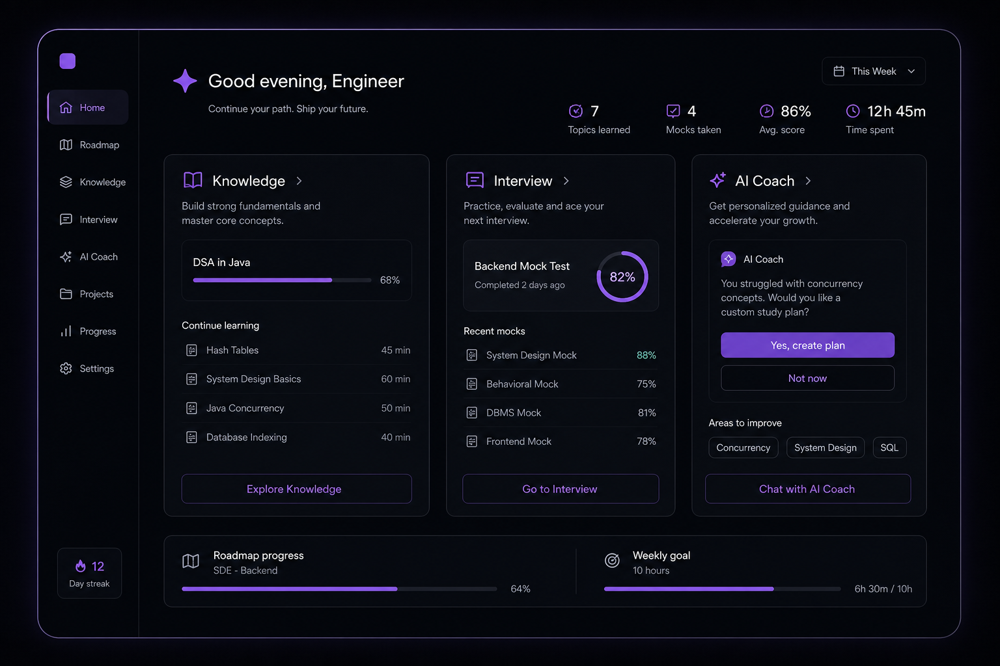

Personal engineering OS — knowledge base, interview simulator, architecture graph, AI coach.

[.NET-adjacent web](https://jetzael.com/engineering-os/) · Next.js · TypeScript

</td>
<td width="2%"></td>
<td width="49%" valign="top">

**Zone 03 — jetzael.com** `LIVE`

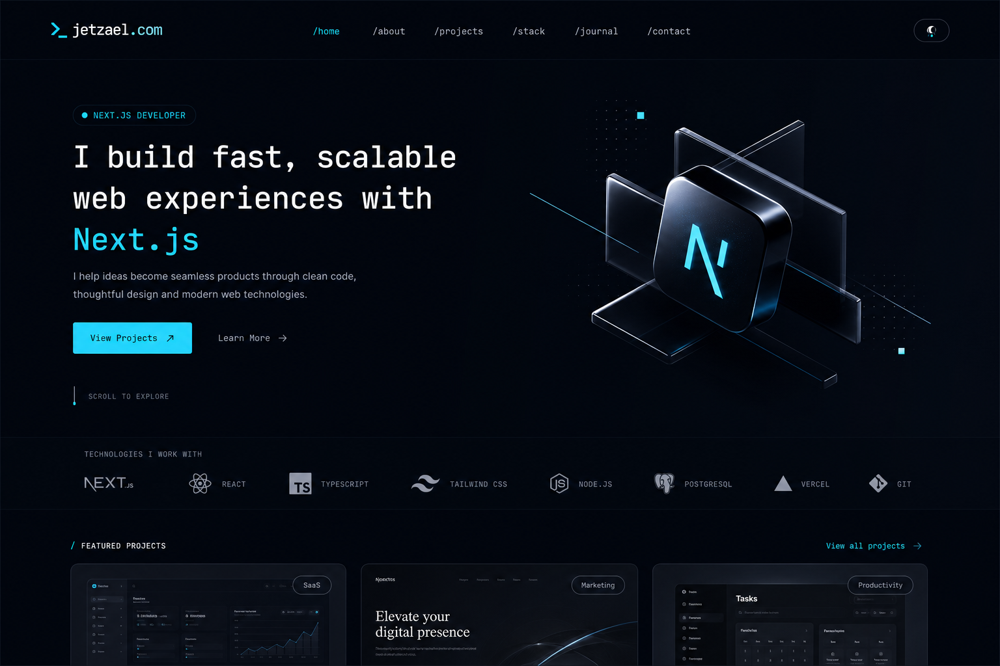

Bilingual portfolio as a real product — editorial design, case studies, SEO, Azure Static Web Apps.

</td>
</tr>
</table>

 

<table>
<tr>
<td width="49%" valign="top">

**Zone 04 — OCR Platform** `LIVE`

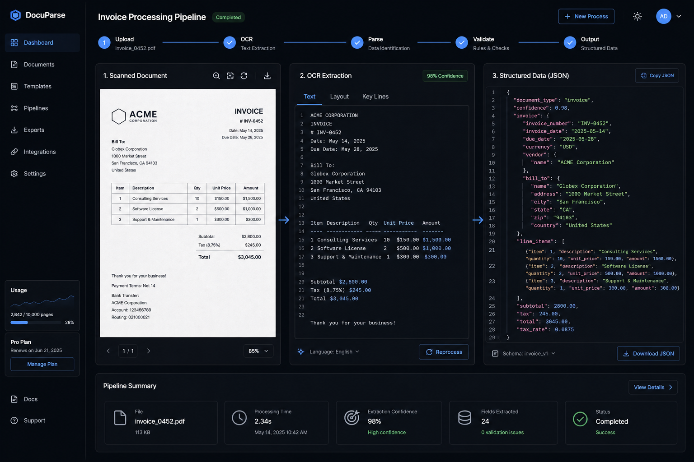

Reusable document intelligence — preprocessing, extraction, validation queues, human review.

</td>
<td width="2%"></td>
<td width="49%" valign="top">

**Zone 08 — AI Prediction** `IN DEV`

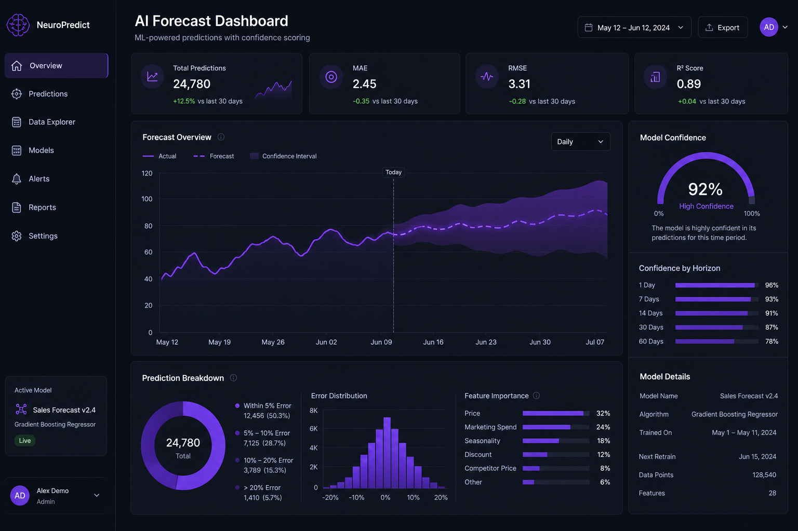

ML-assisted forecasting — data pipelines, model training, .NET inference gateway.

`Python` · `Azure AI`

</td>
</tr>
</table>

 

<table>
<tr>
<td width="32%" valign="top">

**Flower Shop** `IN DEV`

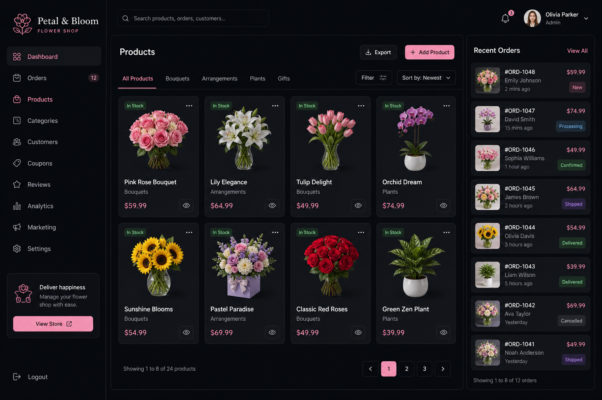

Catalog, orders, admin dashboards.

</td>
<td width="2%"></td>
<td width="32%" valign="top">

**Tattoo Studio** `IN DEV`

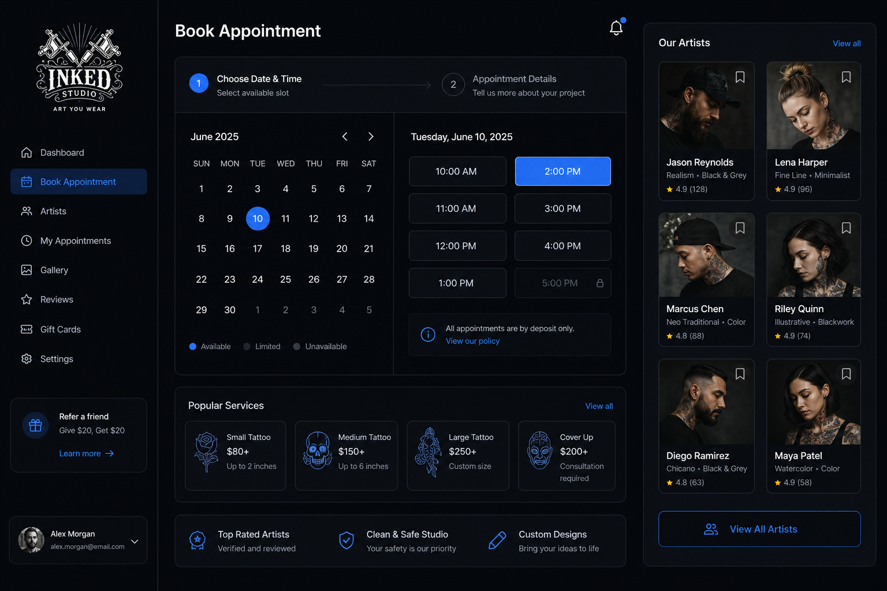

Booking, artist calendars, light CRM.

</td>
<td width="2%"></td>
<td width="32%" valign="top">

**Healthcare** `CLEARED`

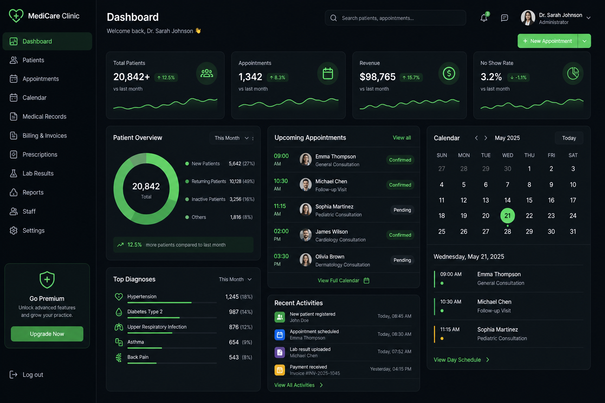

Clinic ops — 20k+ patients, Humana-scale delivery.

</td>
</tr>
</table>

---

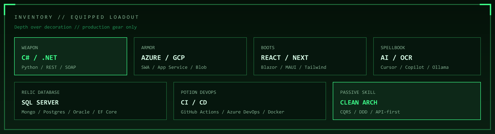

| Slot | Equipped |
|:--|:--|
| **Weapon** | C# · .NET · Python · REST · Microservices |
| **Armor** | Azure · GCP · Static Web Apps · App Service · Blob · Cloudflare |
| **Boots** | React · Next.js · TypeScript · Blazor · MAUI · Tailwind |
| **Spellbook** | Cursor · Copilot · Claude · OpenAI · Ollama · OCR pipelines |
| **Relic** | SQL Server · MongoDB · PostgreSQL · Oracle · EF Core |
| **Potion** | GitHub Actions · Azure DevOps · Docker · CI/CD |
| **Passive** | Clean Architecture · CQRS · DDD · API-first system design |

### How the party fights

AI is a multiplier — never an autopilot. Architecture, contracts and production review stay human.

| Companion | Role in the run |
|:--|:--|
| **Cursor** | Primary IDE — features, refactors, multi-file architecture |
| **Claude Code** | Deep reasoning — system design and trade-offs |
| **GitHub Copilot** | Inline completion — tests, boilerplate, scaffolding |
| **Ollama** | Local LLMs — private RAG for Career OS |

---

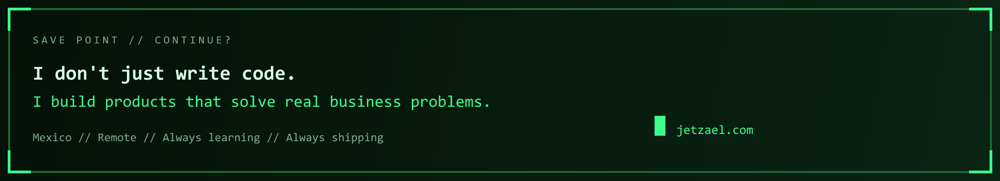

  
  &nbsp;
  
  &nbsp;
  
  &nbsp;
  

  <code>Mexico · Remote · github.com/jetzasead23 · Always shipping</code>

