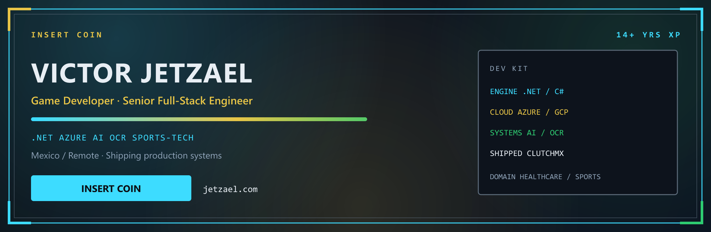
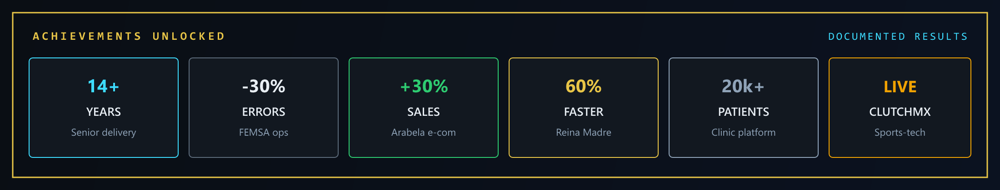
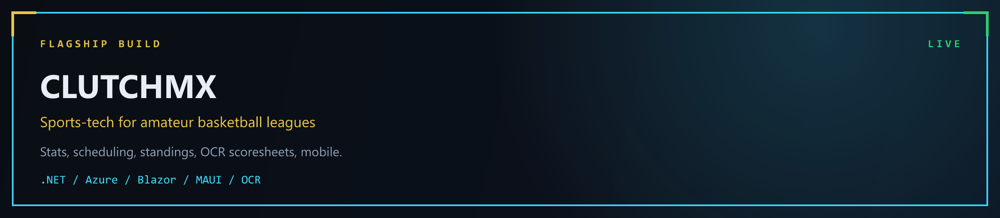
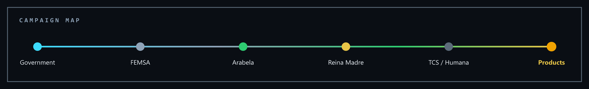

<!-- GitHub Profile · jetzasead23 · Game Developer HUD -->
<!-- Local: ./assets/  ·  Live: https://github.com/jetzasead23 -->


<a href="https://jetzael.com">
  
</a>

### Hi there 👋 🎮

## I'm Victor Jetzael Velez Argueta 🕹️

### Game Developer · Senior Full-Stack Engineer · 14+ yrs XP 👾

<p align="center">
  <a href="https://jetzael.com"></a>
  <a href="https://www.linkedin.com/in/victor-velez23"></a>
  <a href="https://clutch-mx.org/"></a>
  <a href="mailto:tenchu13@hotmail.com"></a>
  <a href="https://jetzael.com/resume-neon-light.pdf"></a>
</p>


[](https://jetzael.com)

#### 🛠️ Engine stack

<p>
  <a href="https://skillicons.dev">
    
  </a>
</p>

#### 🧰 Backend, data & cloud

<p>
  <a href="https://skillicons.dev">
    
  </a>
</p>

---

<h3>🎮 Developer Profile</h3>

- ⭐ **Game developer + senior full-stack** · .NET · Azure · AI · Mexico / Remote
- 🎯 **14+ years** shipping production systems across government, enterprise, healthcare, and sports-tech
- 🏀 Flagship product **[CLUTCHMX](https://clutch-mx.org/)** — live SaaS for amateur basketball leagues
- 🧠 **[Career OS](https://jetzael.com/engineering-os/)** — personal engineering OS, AI coach, interview sim
- 🌱 Exploring **OCR**, **RAG**, and AI-assisted delivery — architecture stays human-reviewed
- 🤝 Open to senior roles, architecture leadership, and product collaborations

```typescript
const developer = {
  handle: "VJVA",
  role: "Game Developer / Senior Full-Stack",
  xp: "14+ years",
  map: "Mexico / Remote",
  engine: ".NET / C#",
  cloud: "Azure / GCP",
  systems: "AI / OCR / RAG",
  shipped: "CLUTCHMX · Career OS",
};
```

---

<h3>🏆 Achievements Unlocked</h3>

Career drops only — documented results, not invented scores.



<p align="center">
  
  
  
  
  
  <a href="https://clutch-mx.org/"></a>
</p>

<p align="center">
  <b>🏆 GitHub trophies</b> — live ranks from <code>jetzasead23</code> public activity
</p>

<p align="center">
  <a href="https://github.com/ryo-ma/github-profile-trophy">
    
  </a>
</p>

---

<h3>🗺️ Builds in production</h3>

<a href="https://clutch-mx.org/">
  
</a>

<p>
  <a href="https://clutch-mx.org/"></a>
  <a href="https://jetzael.com/en/clutchmx/"></a>
</p>

<table>
<tr>
<td width="50%" valign="top">

🧠 **AI / RAG Platform** · Private

Local RAG, interview simulation, and an AI coach inside a personal engineering OS. Architecture knowledge stays human-reviewed before production.

`Python` · `.NET` · `Azure AI` · `Ollama`

[Career OS](https://jetzael.com/engineering-os/)

</td>
<td width="50%" valign="top">

📄 **OCR Document Intelligence** · Live

Reusable document pipeline: preprocess, extract, validate, and human review. In production on CLUTCHMX game sheets.

`.NET` · `Azure` · `OCR` · `SQL Server`

[Architecture](https://jetzael.com/en/clutchmx/)

</td>
</tr>
<tr>
<td width="50%" valign="top">

🏗️ **.NET Clean Architecture**

API-first systems with Clean Architecture, CQRS, and DDD — used across enterprise healthcare delivery and independent products.

`C#` · `.NET` · `REST` · `Microservices`

</td>
<td width="50%" valign="top">

⚙️ **Automation Platform** · In development

CI/CD, workflow automation, and AI-assisted operational systems. Structured for product reuse — no public repository yet.

`.NET` · `Python` · `Azure` · `GitHub Actions`

</td>
</tr>
</table>

---



<h3>📜 Campaign log</h3>

🏛️ **Contraloría · Estado de México** · Head of Supervision Advancement · 2012–2013  
`Oracle` · `PHP` · `ASP` — Internal process automation on government web systems.

🥤 **Coca-Cola FEMSA** · Development Analyst · 2013–2015  
`.NET` · `Oracle` · `SSIS` — National operations APIs. **30% fewer operational errors.**

💄 **Arabela Holding** · Senior Development Analyst · 2015–2019  
`C#` · `SQL Server` · `SSIS` — E-commerce modernization. **+30% online sales.**

🏥 **Reina Madre** · Full-Stack Developer · 2020–2022  
`C#` · `Microservices` · `MySQL` — Clinic platform for **20k+ patients**. **60% faster ops.**

🏢 **TCS · Humana Inc** · Senior Full-Stack Developer · 2022–Present  
`C#` · `Azure` · `GCP` · `MongoDB` — Enterprise healthcare, CI/CD, US-team delivery.

🚀 **Building Products** · Independent  
`.NET` · `Azure` · `AI` — [CLUTCHMX](https://clutch-mx.org/) live SaaS and [Career OS](https://jetzael.com/engineering-os/).

---

<h3>🛠️ Tech skills</h3>

- 💻 C# · .NET · Python · React · Next.js · TypeScript · Blazor · MAUI
- 🗄️ SQL Server · MongoDB · PostgreSQL · Oracle · EF Core · REST · Microservices
- ☁️ Azure · GCP · App Service · Blob · Static Web Apps · Cloudflare · Docker
- 🤖 Cursor · Copilot · Claude · OpenAI · Ollama · OCR pipelines
- ⚙️ GitHub Actions · Azure DevOps · CI/CD · Clean Architecture · CQRS · DDD

AI is a multiplier — never an autopilot. Architecture, contracts, and production review stay human.

---

<h3>📊 GitHub HUD</h3>

Live widgets for **jetzasead23**. They show public GitHub activity — not career years, not private enterprise repos.

<div align="center">
  
  
</div>

<div align="center">
  
</div>

<p align="center">
  
</p>

---

<h3>🌐 Let's connect</h3>

Available for senior engineering roles, architecture leadership, and product collaborations.

**Focus:** ☁️ cloud platforms · 🤖 AI-assisted delivery · 🏀 sports-tech · 🏥 healthcare systems · 🇲🇽 Mexico / Remote

<p align="center">
  <a href="https://jetzael.com"></a>
  <a href="https://www.linkedin.com/in/victor-velez23"></a>
  <a href="mailto:tenchu13@hotmail.com"></a>
  <a href="https://jetzael.com/resume-neon-light.pdf"></a>
  <a href="https://jetzael.com/engineering-os/"></a>
</p>


<p align="center">
  <b>👾 Thanks for dropping by — INSERT COIN to start a build.</b>
</p>

<p align="center">
  
  
</p>

<p align="center">
  <i>Built in Mexico. Shipped to production.</i>
</p>
